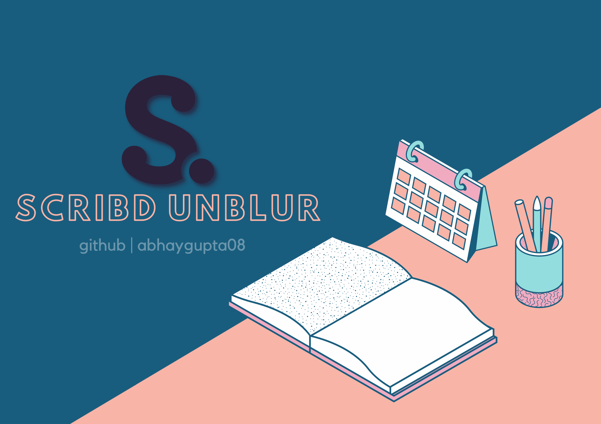
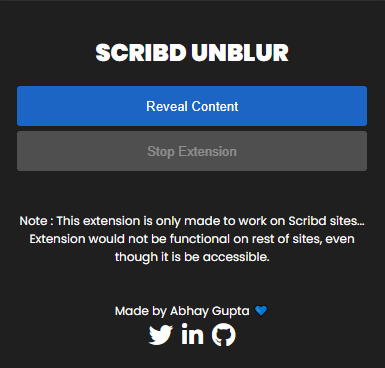
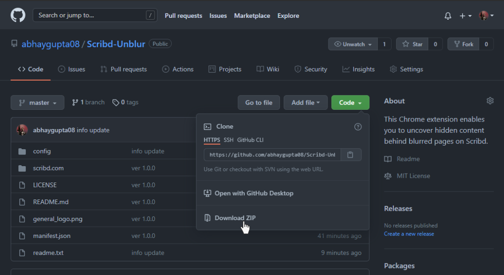
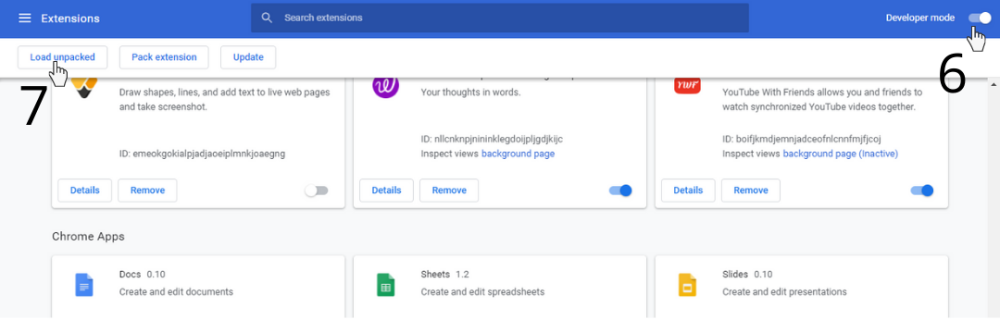

    

  
  
  

 
<h1> Scribd Unblur [Chrome Extension] </h1>

This **Chrome extension** enables you to uncover hidden content behind blurred pages on **Scribd**.

<h2> 🏹 Demonstration </h2>

This is a quick demonstration of how this tool works.

<h2> ⚙ Installation </h2>
<ol>
  <li> Download this zip file and Extract it.  
    

</li>
  <li>Unzip that zip file in your folder.</li>
<li>Then Open Chrome Browser.</li>
  <li>Paste <code>chrome://extensions</code> in Url Bar.</li>
  <li> Turn On Developer Mode. 👨‍💻
  

  </li>
  <li>Click on Load Unpacked and select that unzipped folder and Click Select.</li>
  <li>Now you can use the extension ✨</li>
  </ol>
  
<h2>📝 Contribute</h2>
This repo is open to contribution and modifications, 
- <b>Star</b> this Repo. 
- <b>Fork</b> this repo. 
- <b>Clone</b> repo from your github to local. 
- Create a <b>new branch</b> and do edits. 
- <b>Push</b> to orgin. 
- Create <b>Pull Request</b>. 
  

<b><i>Star this Repository and you can visit to my profile and see some more Projects like this.</i></b>
